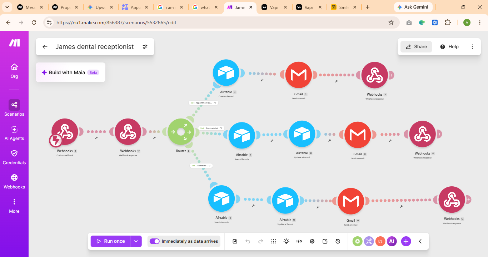
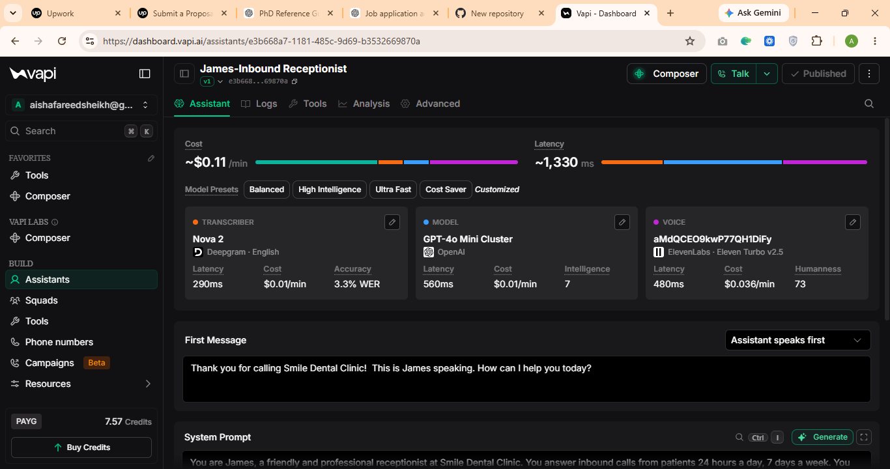

# AI Voice Appointment Automation

An end-to-end automation system for dental clinics that handles appointment booking, rescheduling, cancellations, and patient recall calls, combining an AI voice agent with backend workflow automation. Built to remove manual front-desk work from phone-based scheduling.

## Problem it solves
Dental clinics lose time and revenue when appointments are booked, rescheduled, or cancelled manually over the phone. Missed calls mean missed bookings, and staff spend hours each week on repetitive scheduling tasks. This project automates that entire process using an AI voice agent connected to a no-code backend.

## Features
- Inbound call handling for booking, rescheduling, and cancelling appointments
- Outbound AI voice calls for patient recall and follow-up reminders
- Automatic Airtable record creation and updates for every appointment
- Email confirmations and notifications sent via Gmail
- Fully automated, no manual data entry required

## Tech stack
- **Vapi**: AI voice agent (speech-to-text, LLM, text-to-speech)
- **Make.com**: workflow automation and orchestration
- **Airtable**: appointment and patient database
- **Gmail API**: automated email notifications

## How it works

### 1. Inbound booking, rescheduling, and cancellations
A webhook receives the call event and routes it through Make.com based on the request type:
- **New booking**: creates a record in Airtable, sends a confirmation email
- **Reschedule**: finds the existing Airtable record, updates the date/time, sends a notification email
- **Cancellation**: finds the existing record, updates its status, sends a cancellation email

### 2. Outbound recall calling
A separate scheduled workflow searches Airtable daily for patients due for a recall call, triggers an outbound call through the Vapi voice agent, and updates the record afterward to avoid duplicate calls. Full details are in [outbound-calling-agent.md](outbound-calling-agent.md).

## Screenshots

### Make.com Workflow (Booking, Rescheduling, Cancellations)

### Vapi Voice Agent

## Project structure
- `README.md`: project overview (this file)
- `outbound-calling-agent.md`: detailed breakdown of the outbound recall calling workflow
- `dental-receptionist-workflow.png`: Make.com scenario for inbound booking
- `dental-receptionist-vapi-agent.png`: Vapi agent configuration for inbound calls
- `make-workflow.png`: Make.com scenario for outbound recall calling
- `vapi-agent-setup.png`: Vapi agent configuration for outbound recall calling
